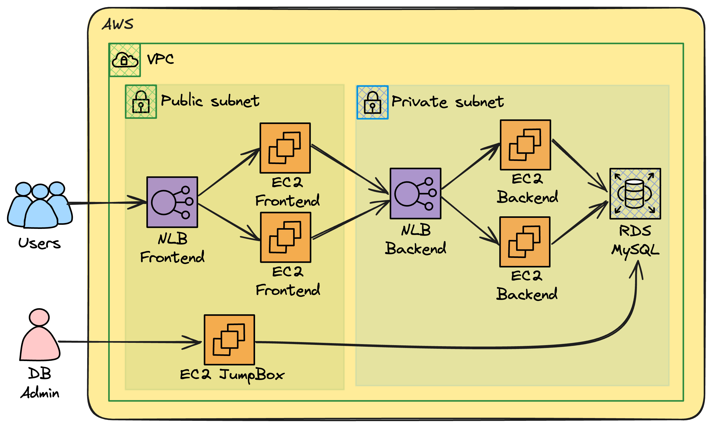

# 🛠️ AWS-TERRAFORM-MULTI-LAYER-APP 🛠️

Demo application to showcase a multi-layer application deployed on AWS with IaC on Terraform.

## Architecture 📜

 <br>

Components:

- Infrastructure as Code in Terraform.
- Load Balancing with Network Load Balancer for the Frontend layer.
- Frontend on EC2 instance(s) with ASG on public subnet with NodeJS server.
- Backend on EC2 instance on private subnet with NodeJS server.
- Database on RDS MySQL on private subnet.
- JumpBox Server for database administration.
- Networking on top of VPC with public/private-with-nat subnet layout.

## Resources in Action 🎩


<br>


<br>


<br>


## Steps to Deploy via Terraform 🚀

0. Clone the repository.

   ```bash
   git clone https://github.com/san99tiago/aws-terraform-multi-layer-app
   ```

1. Deploy infrastructure and applications (both frontend and backend) with:

   ```bash
   # NOTE: Make sure to have AWS Credentials on the terminal...
   bash deploy_infrastructure.sh
   ```

2. Configure the database (only once to load the data):

   ```bash
    ### FOLLOW THE STEPS IN "configure_database.sh"
   ```

## Highlights 💡

Thanks to "Juan Ruiz" for building the initial version of the demo app (frontend/backend) sample servers.

## Author 🎹

### Santiago Garcia Arango

<table border="1">
    <tr>
        <td>
            <p align="center">Curious DevSecOps Engineer passionate about advanced cloud-based solutions and deployments in AWS. I am convinced that today's greatest challenges must be solved by people that love what they do.</p>
        </td>
        <td>
            <p align="center"></p>
        </td>
    </tr>
</table>

## LICENSE

Copyright 2024 Santiago Garcia Arango.
